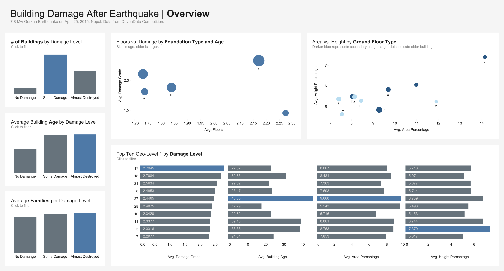

# Richter's Predictor: Modeling Earthquake Damage
Predicting the level of damage to buildings caused by a 2015 earthquake in Nepal based on aspects of building location and construction. Submission as part of Driven Data competition.

As of July 28, 2024, my current rank is #1582 out of 7657 participants that joined.

## Contents
1. [Data Characteristics](#data-characteristics)
2. [Insights](#insights)
3. [Recommendations](#recommendations)
4. [Tableau Dashboard](#dashboard)
5. [Citations](#citations)

## Data Characteristics
The data contained information about each building's number of floors before the earthquake, the number of families per building, whether the building had any secondary uses (such as police station, etc), and other information related to the type of foundation, configuration, and construction data.

## Insights
### Building Characteristics
- Buildings that were almost completely destroyed were around **10 years older**, on average, than those that suffered no damage.
- For all three surface conditions (t, o, and n), average damage levels were similar, at around 2.2/3.
- Over **50% of buildings have a mud/mortar/stone superstructure**. However, buildings with **stone flag** superstructure suffered the most damage, with **47% being almost completely destroyed**. On the other hand, **64% buildings with RC Engineered superstructures suffered no damages**, and only 2% were heavily damaged. However, **only 1% of all buildings have an RC Engineered superstructure**.
- Only **8% of buildings have a secondary usage**. Over **40%** of buildings that were also used as **institutions** suffered **no damages**. On the other hand, buildings that also served for **agriculture** suffered the most damages, with over **31% being almost completely destroyed**, and **only 5% suffering no damages**.
- On average, buildings that suffered no damages had an average area percentage **30% larger** than that of buildings that were completely destroyed. Also, they were **6% shorter**.

### High-Risk Areas
- The most affected Geo Level 1 ID areas were **17** and **18**, with an average damage level of **2.79** and **2.71** respectively. On the other hand, **24** and **26** were the least affected, with an average damage level od **1.89** and **1.73**.
- For Geo Level 1 IDs 17 and 18, the **mud/mortar/stone superstructure was the most common**, accounting for around **50%** of the buildings in both areas. For 24 and 26, **Cement Mortar Brick and Timber** were much more common, collectively accounting for almost **50%** in both areas.

## Recommendations
### 1. **Prioritize Retrofitting of Older Buildings**
- Buildings that were almost completely destroyed were approximately 10 years older on average. Implementing targeted retrofitting and strengthening programs for older buildings, particularly those over a certain age threshold, could significantly reduce the risk of severe damage in future events.

### 2. **Promote and Incentivize RC Engineered Superstructures**
- Despite being rare (only 1% of buildings), RC Engineered superstructures have shown exceptional resilience, with 64% of these buildings suffering no damage. Expanding the use of RC Engineered superstructures through incentives, subsidies, or building code updates could greatly enhance overall structural resilience.

### 3. **Reduce Reliance on Mud/Mortar/Stone Superstructures**
- Over 50% of buildings use mud/mortar/stone superstructures, which are particularly vulnerable in high-risk areas like Geo Level 1 IDs 17 and 18. Transitioning to more durable materials, like Cement Mortar Brick or RC Engineered structures, especially in high-risk zones, should be a priority.

### 4. **Enhance Institutional Buildings and Diversify Secondary Usage**
- Buildings with institutional secondary usage showed better resilience, with over 40% suffering no damage. Encouraging the development of multi-purpose buildings with secondary institutional usage could improve community resilience. Conversely, stricter regulations should be implemented for buildings used for agricultural purposes, which are particularly vulnerable.

### 5. **Focus on High-Risk Areas with Targeted Infrastructure Improvements**
- Geo Level 1 IDs 17 and 18 have the highest average damage levels, largely due to the prevalence of vulnerable superstructures. These areas should be prioritized for infrastructure improvements, including retrofitting programs, better construction practices, and possibly relocation initiatives for the most at-risk buildings.

### 6. **Incentivize Construction of Larger, Shorter Buildings**
- Buildings that suffered no damage had a 30% larger area and were 6% shorter than those that were completely destroyed. Encouraging the construction of larger, shorter buildings, particularly in vulnerable regions, could mitigate damage and enhance structural integrity.

### 7. **Implement Area-Specific Building Codes and Zoning Laws**
- Given the varying risks across different Geo Level 1 ID areas, area-specific building codes should be developed. For example, Geo Level 1 IDs 17 and 18 may require stricter regulations regarding the use of mud/mortar/stone, while Geo Level 1 IDs 24 and 26 could maintain current practices but emphasize the use of Cement Mortar Brick and Timber, which have proven more resilient.

## Dashboard
The Tableau Public dashboard can be found [here](https://public.tableau.com/app/profile/owen.xu/viz/DashboardTemplate_17238271781070/EarthquakeDashboard).

## Citations
DrivenData. (2019). Richter's Predictor: Modeling Earthquake Damage. Retrieved [Month Day Year] from https://www.drivendata.org/competitions/57/nepal-earthquake.